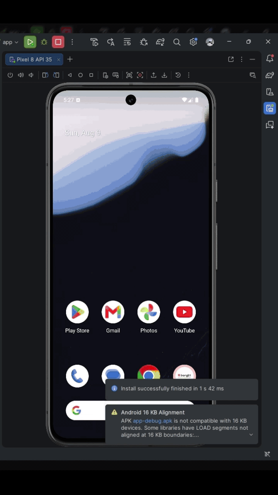

# Android Intermediate Learning Project

## About
This project is part of my continued learning journey in Kotlin and Android application development, focusing on more advanced Android concepts and practices.

The project explores how to improve user experience through Custom View, Widget, WebView, and Animation, while also covering application features such as Media and Geolocation.

As part of the advanced database learning, the project also explores database practices commonly used in larger-scale applications, including database relationships, pre-populated databases, database migrations, RawQuery, and Paging.

## Tech Stack
| Category |	Technology |
| ----- | ----- |
| Language |	Kotlin |
| Platform |	Android |
| UI	| Custom View, Widget, WebView |
| Database	| Room Database |
| Testing	| Android Testing Framework |
